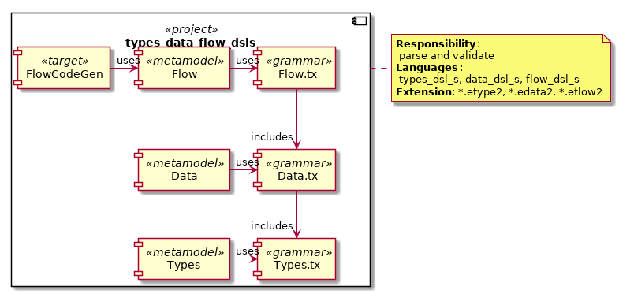

# Multi-metamodel examples (textX)

## Overview

Here, we present some DSLs consisting of multiple metamodels.
 * [01_separate_projects](01_separate_projects) - textX metamodels referencing each other.
   * [types_dsl](01_separate_projects/types_dsl) - separate project (see below).
   * [data_dsl](01_separate_projects/data_dsl) - separate project (see below).
   * [flow_dsl](01_separate_projects/flow_dsl) - separate project (see below).
   * [flow_codegen](01_separate_projects/flow_codegen) - separate project (see below).
 * [02_shared_grammar](02_shared_grammar) - textX metamodels based on grammars including each other.
 * [03_non_textx_models](03_non_textx_models) - textX metamodel referencing a JSON file.

The goal is
 * to show how to **setup textX DSL projects** (focus: multi metamodels), and
 * to show how to **integrate textX DSLs into textX-LS**.

### [01_separate_projects](01_separate_projects)

**Four separate python projects** define three metamodels based on three
grammars and one code generator project. The metamodels reference each other.


The **Types DSL** defines types (like an int). This is a 
trivial DSL with no dependencies to other DSLs.
The **Data DSL** defines data structures 
(containing attributes based on the "Types DSL").
The **Flow DSL** defines algorithms with inputs/outputs
based on the "Data DSL". It also allows to connect 
algorithms (matching structure types are checked).

An example model file "types.type":

    type int
    type string

An example model file "data_structures.data":

    #include "types.type"
    data Point { x: int y: int}
    data City { name: string }
    data Population { count: int}

An example model file "data_flow.flow":

    #include "data_structures.data"
    #include "types.type" // double include, loaded 1x only
    
    algo A1 : Point -> City
    algo A2 : City -> Population
    connect A1 -> A2

#### Challenges for an Editor

 * A simple metamodel ```types_dsl``` (including validation) is defined 
   to show how to integrate such a project
   into the textX-LS framework.
 * Multiple files are included (allow to navigate across files;
   metamodels reference each other).
 * Multiple metamodels are used.
 * Model validation for *.flow and *.types is defined.
 * A code generator is defined.

### [02_shared_grammar](02_shared_grammar)

**One python project** defines three metamodels based on three
grammars (including each other).

 * The same semantics as in the previous section are defined.



#### Challenges for an Editor

 * Multiple files are included (allow to navigate across files;
   shared grammars).
 * Multiple meta models are used
 * Model validation for *.flow and *.types is defined.


### [03_non_textx_models](03_non_textx_models)

A textX model references a JSON object.
 


#### Challenges for an Editor

 * Non-textX files are included (JSON file).
 * Non-textX elements from the JSON file (textX type "OBJECT") are referenced from the textX grammar using
   a custom scope provider.
 * Model validation is defined (in terms of a scoping validation; no special validation rules were added so far).


## Installation and usage of the DSLs

To install the metamodels and run the tests (on unix-like system), you can do the following: 

    egrep "# build\s*$" README.md | sed -r 's/# build/|| exit 1/' > temp.sh
    # Have a look at temp.sh before executing...
    bash temp.sh


### Setup the virtual environment

	virtualenv venv -p $(which python3) # build
	source ./venv/bin/activate # build

### Install all example projects

	pip install -r requirements_dev.txt                # build 
	pip install 01_separate_projects/types_dsl/        # build
	pip install 01_separate_projects/data_dsl/         # build
	pip install 01_separate_projects/flow_dsl/         # build
	pip install 01_separate_projects/flow_codegen/     # build
	pip install 02_shared_grammar/                     # build
	pip install 03_non_textx_models/                   # build

### Check style guide (for all projects)

	flake8                                             # build

### Run the tests 

	py.test 01_separate_projects/types_dsl/tests       # build
	py.test 01_separate_projects/data_dsl/tests        # build
	py.test 01_separate_projects/flow_dsl/tests        # build
	py.test 01_separate_projects/flow_codegen/tests    # build
	py.test 02_shared_grammar/tests/                   # build
	py.test 03_non_textx_models/tests                  # build

### Run the textx plugins

Here, you can validate the model used by the tests files interactively.

#### flow_codegen, flow_dsl, data_dsl and types_dsl

	cd 01_separate_projects/flow_codegen
	virtualenv venv -p $(which python3)
	source ./venv/bin/activate
	pip install -r requirements_dev.txt
	pip install -e ../types_dsl
	pip install -e ../data_dsl
	pip install -e ../flow_dsl
	pip install -e .

Then run the textx command...

...and validate model files:

    textx check tests/models/*

... or generate some code (note: ```tests/models/data_flow.flow.pu``` is generated)

    textx generate --target PlantUML tests/models/data_flow.eflow1 


#### types_data_flow_dsls

Here, we have one validator for all DSLs (metamodel selected by filename suffix).

	cd 02_shared_grammar/tests/models/
	find . -name "*.e*" -exec textx check {} \;

Expected outcome

	...tests/models/types.etype2: OK.
	...tests/models/types_with_error.etype2:1:1: error: types must be lowercase
	...tests/models/data_structures.edata2: OK.
	./types_with_error.etype2:1:1: error: types must be lowercase
	./data_flow_with_error.eflow2:5:1: error: algo data types must match
	...tests/models/data_flow.eflow2: OK.
	...tests/models/types_with_error.etype2:1:1: error: types must be lowercase

#### json_ref_dsl

We can validate if all references to a json file from a textX model are ok:

	cd 03_non_textx_models/tests/models
	textx check ok.jref3 

Expected output: no error ("OK")

